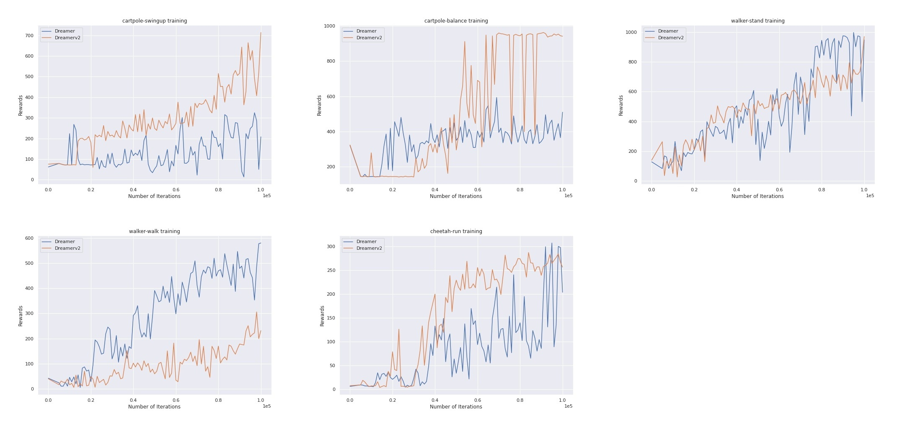
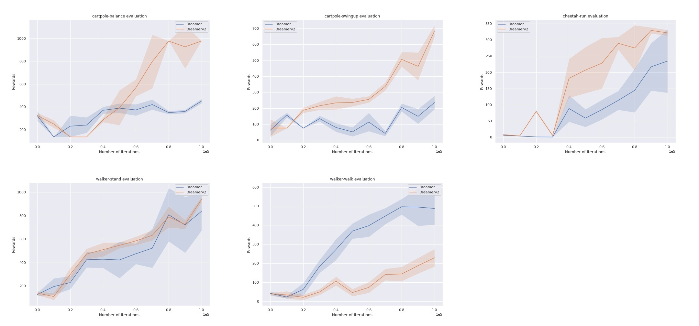

# Dreamer

Dreamer is a visual Model-Based Reinforcement algorithm, that learns a world model which captures latent dynamics from high-level pixel images and trains a control agent entirely in imagined rollouts from the learned world model.

This work is my attempt at reproducing Dreamerv1 & v2 papers in pytorch specifically for continuous control tasks in deepmind control suite.

#### Noteworthy differences from original and prior works:

 1. This work compares Dreamer and Dreamerv2 agents for continuous control tasks only. Only KL-Balancing is used for dreamerv2 and policy type remains the same as dreamerv1 i.e. Tanh transformed MultivariateNormalDiag distribution.
 2. This work doesn't train dreamerv1 and v2 for 2M timesteps as did in the papers, instead both the agents are trained till 100K timesteps.
 3. All experiments are carried out on free single GPUs(Tesla T4) on google colab. Training time on Tesla T4 for 100K timesteps ~ 3 Hrs
 4. Due to limited computational resources (colab strict timeouts) results produced here are for five control tasks and are run for single seed only. 
 5. Hence plot_results are produced by running agents for 10 eval episodes for single seed. A fair evaluation would require running experiments for multiple seeds, this repo serves as a working implementation for both agents.

Evaluated agents Left: Dreamerv1,  Right:Dreamerv2 after training for 100K timesteps. 

  
  

For further information regarding methodology and experiments refer these papers
1. [Dreamerv1 - DREAM TO CONTROL: LEARNING BEHAVIORS BY LATENT IMAGINATION](https://arxiv.org/pdf/1912.01603.pdf)
2. [Dreamerv2 - MASTERING ATARI WITH DISCRETE WORLD MODELS](https://arxiv.org/pdf/2010.02193.pdf)

## Code Structure
Code structure is similar to original work by Danijar Hafner in Tensorflow

`dreamer.py`  - main function for training and evaluating dreamer agent

`utils.py`    - Logger, miscallaneous utility functions

`models.py`   - All the networks for world model and actor are implemented here

`replay_buffer.py` - Experience buffer for training world model

`env_wrapper.py`  - Gym wrapper for Dm_control suite

All the hyperparameters are listed in main.py and are avaialble as command line args.

#### For training
`python dreamer.py --env 'walker-walk' --algo 'Dreamerv1' --exp 'default_hp' --train`
#### For Evaluation
`python dreamer.py --env 'walker-walk' --algo 'Dreamerv1' --exp 'eval' --evaluate --restore --checkpoint_path '<your_ckpt_path>'`
### Google_Colab
 I have added a colab file   to train and evaluate on freely avilable GPUs on google colab for quick reproducilibilty.

## Plot Results
Training and Evaluation results for dreamerv1 and v2 agents

Evaluation results after traning for 100k steps, average returns and standard deviations are reported for 10 eval episodes
| Control Task | Dreamer | Dreamerv2 |
| ---| --- | ---|
| cartpole-balance | 450.6 ± 19.54  | 976.8 ± 1.11|
| cartpole-swingup | 235.8 ± 42.74 | 684.1 ± 36.97|
| walker-stand| 836.1 ± 165.2 | 937.5 ± 25.91 |
| walker-walk| 487.9 ± 84.81| 228.7 ± 45.95|
| cheetah-run| 234.6 ± 92.67 | 321.6 ± 8.91 |

Training Plots:
Training Returns plotted against environment timesteps

Evaluation Plots:
Evaluation is done at every 10k steps during training for 10 eval episodes. 
Plots show average returns as solid lines and std deviations as shaded areas

## Acknowledgements
This code is heavily inpsired by following open-source works

dreamer by Danijar Hafner(lead author of both papers) : https://github.com/danijar/dreamer/blob/master/dreamer.py

dreamer-pytorch by yusukeurakami : https://github.com/yusukeurakami/dreamer-pytorch

Dreamerv2 by Rajghugare : https://github.com/RajGhugare19/dreamerv2
